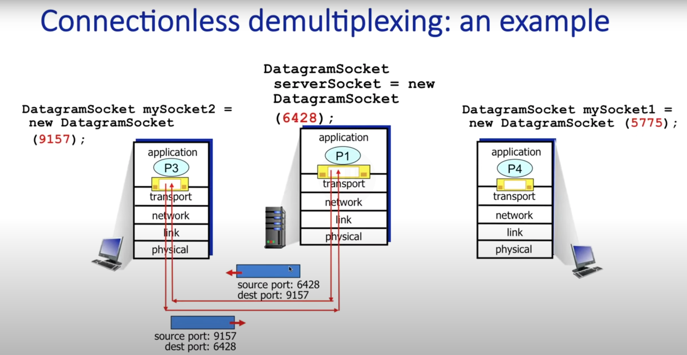
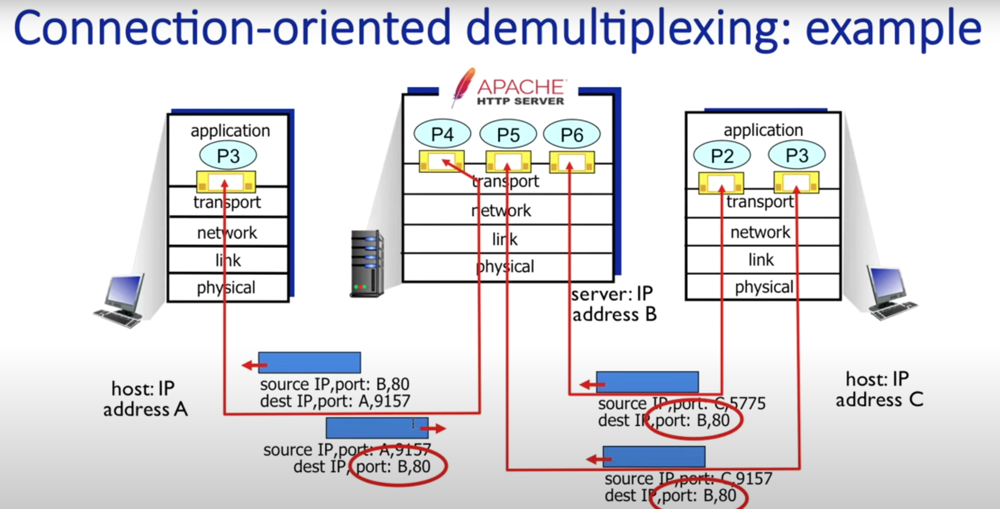

# Camada de Transporte

## Pontos a serem considerados

-   Multiplexação e demultiplexação
-   Sockets
-   Protocolos de transporte: TCP e UDP
-   Transferência confiável de dados
-   Temporização
-   Algumas aplicações requerem baixa latência
-   Throughput
-   Vazão mínima necessária para o bom funcionamento da aplicação
-   Segurança - Criptografia, integridade dos dados

## Multiplexing / Demultiplexing

Since a computer can have multiple processes, the data sent by one process of the client needs to be multiplexed so that they are all sent by the same IP address  
When it reaches the server, it needs to be demultiplexed to the correct process that should handle the data

### Sockets

When a connection is established, a socket is allocated in the client in a given port number  
And the server has its own socket in a given port number, and it is ready to receive request in that port

In TCP connections, the server creates a socket for each client since it's connection-oriented

#### Why Sockets

The layers below application are controlled by the operating system  
The socket is the API provided by the operating system where the applications, in the application layer, can receive and send data to the network  
It's essentially a buffer

### Datagrams

The datagrams have, at the top-level, the source IP address and the destination IP address  
With this information the routers can deliver the datagram to the correct IP address

The datagram has one transport-layer segment  
This segment will have the source port and destination port.  
The Operating System will know the right socket based on these ports  
In TCP connections, the OS will use a 4-tuple to identify the right socket

#### UDP Demultiplexing

#### TCP Demultiplexing

## Principais protocolos

-   TCP: Transmission Control Protocol
-   UDP: User Datagram Protocol

### TCP

-   transporte confiável
-   controle de fluxo
-   controle de congestionamento
-   orientado à conexão (socket)
-   não fornece garantia mínima de taxa de transferência e segurança

#### TLS

Protege o TCP  
Transport Layer Security (TLS)  
Implementado na camada de aplicação  
Criptografia

### UDP

Protocolo de transporte de Internet sem frescuras, básico.

-   Segmentos UDP podem ser:
    -   perdidos
    -   entregues fora de ordem para o aplicativo
-   Sem conexão
    -   sem handshaking entre o remetente e o receptor UDP
    -   Cada segmento UDP é tratado independentemente dos outros

> Congestion in the network is the primary reason for packet loss in UDP, as every communication network has a flow limit.  
> For example, network congestion is similar to a traffic jam on the road, where exceeding the maximum number of vehicles allowed on a given road may cause traffic to slow or stop during peak hours

#### Por que existe UDP?

Sem handshaking

Simples

Tamanho de cabeçalho pequeno

Sem controle de congestionamento

#### Aplicações do UDP

-   Aplicativos de streaming de multimídia
-   DNS
-   SNMP: Protocolo de gerência de redes
-   HTTP/3
    É possível usar UDP e implementar transferência confiável em outra camada

-   Adicionar confiabilidade necessária na camada de aplicativo
-   Adicionar controle de congestionamento na camada de aplicativo

#### Estrutura de um pacote UDP

-   Header
-   Payload
    > **Header**
    >
    > -   source port
    > -   destination port
    > -   length
    > -   checksum

#### Checksum

##### Remetente

Trata o conteúdo do segmento UDP como uma sequência de números inteiros de 16 bits  
adição dos bits de cada segmento  
Resultado armazenado no checksum

##### Destinatário

Soma os bits de cada segmento e vê se bate com o valor do checksum

## Princípios de transferência de dados confiável

Para garantir a confiabilidade de um protocolo que se utiliza de serviços não confiáveis, se faz necessário implementar funcionalidades que garantam essa confiabilidade
Ex: tratamentos de erros, reenvios de requisições
